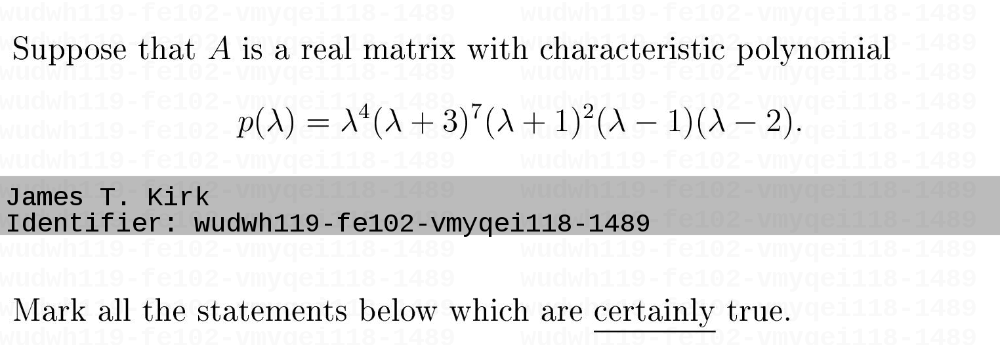

# learn

These are some Javascript files I wrote to add watermarks to image files or create personalized questions in Blackboard Learn exams. This was done to add some extra security measures (in a time of rampant cheating). In my case they worked really well and let me catch dozens of cheaters. I am sharing them with the hope that they may be useful for someone else.

These scripts are not ready to be deployed "as-is", regard them as proof-of-concept examples. The user is expected to modify them to suit one's own use case.

Here is an example image that can be created with these scripts:

## How do they work?

They rely on the ability to use Javascript code in Blackboard Learn's questions editor. You can insert HTML code directly using the HTML editor (which opens by clicking the HTML button in the question editor). Insctructors are by default authorized to use Javascript but the system administrators may disable it. If that is the case, there is nothing useful here for you.

Extracting the student's name relies on that name being displayed somewhere in the exam page. Typically, on any Blackboard Learn page the user's full name is displayed in a black box on the top right corner. It is contained in an HTML element named `global-nav-link` and this is where we fetch the name from.

More detailed information on the uage is containedi n the file [USAGE.md](USAGE.md).

## Caveats

It seems that Blackboard Learn's parser does not handle punctuation marks or parentheses well. For example instering the following into the HTML editor may result in a non-functional script:

    

Use this instead:

    

It is best to put the main code in a separate `.js` file and use the HTML editor just to load it and call the desired method from there. This is the approach used in these files.

Also, like all Javascript code, the source code will be available to anyone loading the page. Therefore a student whose watermarked/personal question found on the internet may claim that some else read the Javascript code, deciphered how it works and created a fake file using her/his name.

To make this scenario unlikely, I actually used [minified](https://javascript-minifier.com/) versions of the files above in the exams. It is also good practice to use confusing functions names. A student who is smart enough to decipher and fake it in a short period of time would almost certainly not need to cheat anyway.
