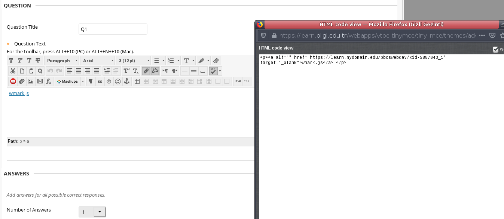
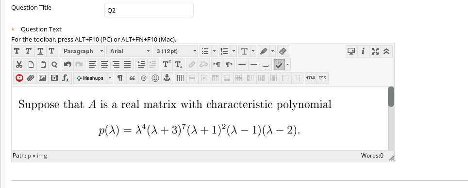
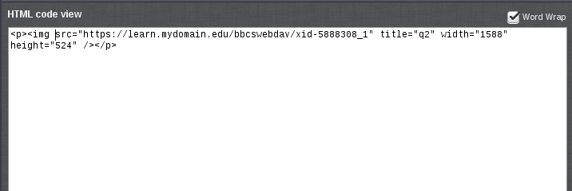
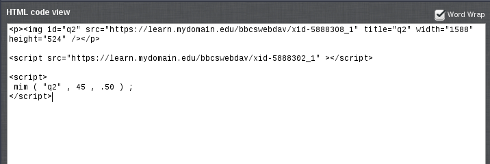

# Usage

There are two kinds of scripts here:

- One for displaying the student's name on an image and watermarking the image with a cryptic code derived from the student name. The purpose of the code is to make the claim "someone else photoshopped my name on it" less reasonable.
- The other scripts create a personalized question, giving each student a question with unique numbers, derived from the student name.

## How to upload and call the Javascript files

It is best to upload the scripts to the Content Collection of the course. The way I find easiest is as follows:

- Create a sample/toy question and add the file(s) as attachment(s).
- Save the question.
- Re-edit the question. When you click the HTML editor, you will find the internal object id of the file in the code:

In this example we see that the address of the file `wmark.js` is `https://learn.mydomain.edu/bbcswebdav/xid-5887643_1`. So, when we prepare the exam questions which use this scripts, we are going to load it by inserting
    
    
    
into the HTML editor.

## Student names

These scripts get the student name from the `global-nav-link` HTML element, which is expected to contain the user's name in a black rectangle on the top right part of the page. Sometimes that text ends with a string like `Activity Updates` and a number, indicating the unread system messages. The scripts throw that part away.

Also, Blackboard Learn seems to truncate the student name string to 37 characters.

## Watermarking

The file for this example is [wmark.js](wmark.js). It main method is `mim()` which takes three parameters: The `id`  if the image to be watermarked, the font size and the position of the upper edge of the strip, measured from the top (a value of, say, `0.43` means 43% of the total height).

Here is a sample application:

You can use the [testpage.html](testpage.html) and [wm_test.js](wm_test.js) files to locally load the image file and test the parameters. To generate the cryptic "identifier" Ceasar encryption plus some other operations are used. The shift parameter and the alpha value for the watermark are hardcoded in the file.

Once the parameters determined, we prepare the actual test question:

1. Prepare and save the question as usual, inserting the image into the editor:
    
2. Re-edit the question and open the HTML editor. Initially, the image element will have no `id` tag:
    
3. We will add the `id` tag to the image element. It should be a unique identifier in the whole HTML document, so do not use generic names that may possibly appear elsewhere. Something like `q2` should be good enough. Then we will insert the code that loads the script and calls the watermark function `mim()`:
        
        
        

    Here is how it looks in the editor:
    
      
    
    See the Caveats section in [README.md](README.md) on the use of spaces above.
4. Save the question (submit). The script should now be working.

Every time you edit the question, Blackboard Learn's parser adds some comment characters such as `/**/` which are harmless. You can ignore them and edit your code parameters.

## Personalized questions with custom parameters

With this method you can create a unique question for each student. Since the mechanism works through Javascript, you will need to grade them manually, though and afterwards the students can not see the the correct answer generated automatically by Blackboard Learn.

You will also need a way to generate a unique parameter to each student name. In my case I went for the simplest solution: Write a function that matches students' names to numbers. Pull the student name list from the Grade Center, trim them down to 37 characters if longer, and copy it to form the Javascript code.

A function directly computing the parameter from the name would be nicer and more secure, though.

The example file for this is [ctext.js](ctext.js). Here the main function is `oks()` which takes no parameters. It fills and empty HTML paragraph with the question text, including personalized parameters. To use it:

1. Load the file [ctext.js](ctext.js) into the Content Collection using the procedure described above in the watermark example. Copy the addres of the uploaded file.
2. When preparing the question, add the following code:
    
        
        

        

The first line calls the uploaded script file, you should of course replace that address with your own file's. The second line creates the empty paragraph to be filled in. The third calls `oks()` to fill it in. This example was prepared for a "fill in multiple blanks" type of question, so in the editor you will also have a line like `
m=[a], n=[b].
` to generate the answer boxes.

I also provide an example script [cimg.js](cimg.js) which inserts custom numbers on an image (I used it to fill in an empty matrix with custom numbers). It also does the strip and watermark. It can be used in a way similar to the watermark example.
